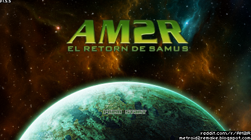

# AM2R-cat



Traducció al català d'**AM2R (Another Metroid 2 Remake) - EL RETORN DE SAMUS**.

> **Nota:** Necessites una còpia d'AM2R per aplicar aquesta traducció.

## Requisits

- **AM2R 1.1** `AM2R_11.zip`(necessari per aplicar el pedaç correctament amb l'AM2R Launcher/AM2R Autopatcher Mac).
- **AM2R Launcher** [Windows/Android] per gestionar i aplicar pedaços i actualitzacions de la comunitat.
  - Més informació i instruccions: https://github.com/AM2R-Community-Developers/AM2RLauncher
- **AM2R Autopatcher** [Mac] per gestionar i aplicar pedaços i actualitzacions de la comunitat.
    - Més informació i instruccions: https://github.com/Miepee/AM2R-Autopatcher-Mac

## Instal·lació manual (idioma)

1. Baixa els fitxers `catalan.ini` i `languages.txt` d'aquest repositori.
2. Copia'ls a la carpeta `lang` del joc.
3. Si ja tens un `languages.txt`, assegura't que inclogui una línia amb:
   ```
   catalan.ini
   ```
4. Engega el joc i selecciona **Català** al menú d'opcions d'idioma.

## AM2R Launcher / actualitzacions de la comunitat

### Windows / Android (AM2R Launcher)

Si utilitzes el perfil **Community Updates (Latest)**, col·loca els fitxers `languages.txt` i `catalan.ini` a:

```
AM2RLauncher/Profiles/Community Updates (Latest)/lang
```

### Mac (AM2R Autopatcher Mac)

Si utilitzes **AM2R-Autopatcher-Mac** amb el perfil **Community Updates**, copia els fitxers a:

```
AM2R-Autopatcher-Mac/data/files_to_copy/lang
```

Una vegada els arxius estan al lloc correcte podeu tornar a executar l’script per del patcher per tenir l’idioma disponible.

> **Avís (Mac):** Si estàs jugant en una versió anterior de macOS, ja has acabat! Si ets a macOS Sequoia o posterior, et queda un pas més. Si intentes obrir el joc, veuràs un error que diu que no es pot obrir i obtindràs un informe d'error. Per solucionar-ho, torneu a obrir la terminal, torneu al directori del pedaç i executeu la següent commanda `codesign --force --deep --sign - /path/to/am2r.app` Quan hagis fet això, el joc funcionarà!

> **Nota (Mac):** els gràfics del títol en català no estan disponibles per aquesta versió.

## Títol personalitzat en català (opcional)

### Instal·lació manual

1. A la carpeta del joc, crea `titles` dins de `lang/` (si no existeix).
2. Copia-hi el PNG del títol personalitzat (per exemple, el que trobaràs a `titles/` d'aquest repositori).
3. Engega el joc: amb la traducció catalana activa, el joc utilitzarà la imatge de títol de:
   ```
   lang/titles/
   ```

### AM2R Launcher (títol personalitzat)

Si utilitzes el perfil **Community Updates (Latest)**, crea també la carpeta i col·loca el PNG a:

```
AM2RLauncher/Profiles/Community Updates (Latest)/lang/titles/
```

## Referències

- [Windows/Android] AM2R Launcher (perfils, pegats i instruccions detallades): https://github.com/AM2R-Community-Developers/AM2RLauncher
- [Mac] AM2R Autopatcher Mac (instruccions detallades): https://github.com/Miepee/AM2R-Autopatcher-Mac
